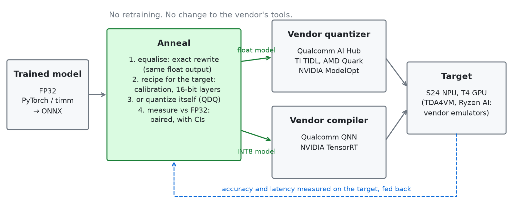
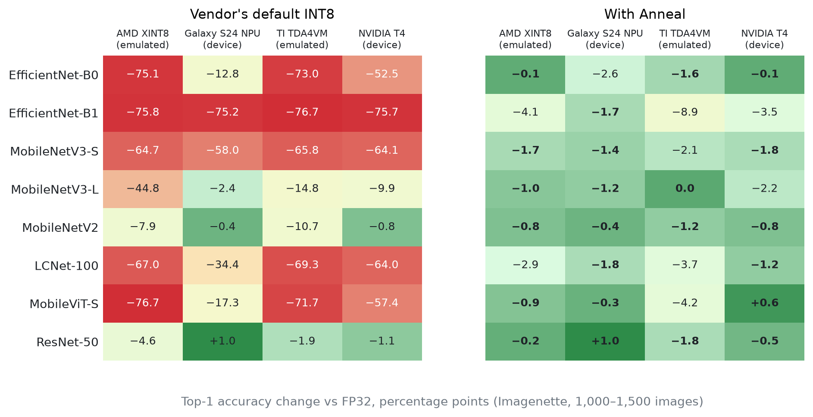
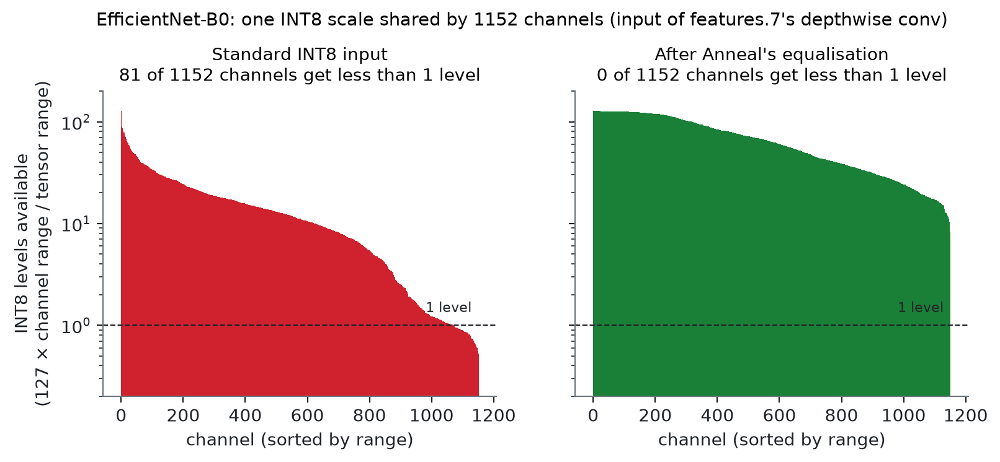
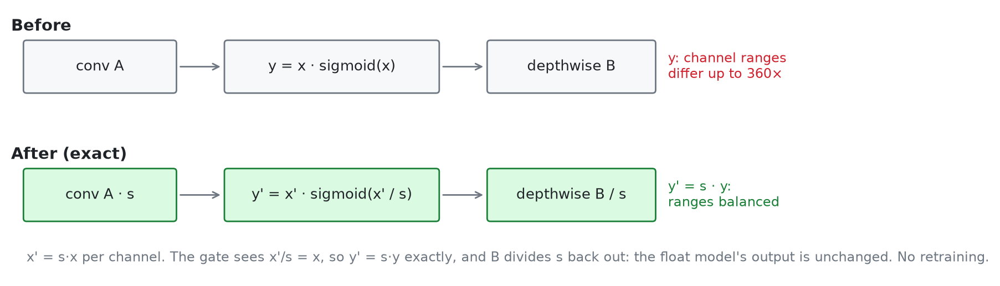

# Anneal

**Measured, hardware-aware INT8 for edge deployment.** Standard INT8 quantization breaks the
gated-depthwise networks used on edge devices (EfficientNet, MobileNetV3, LCNet, MobileViT):
on the default INT8 path of AMD, Qualcomm, TI and NVIDIA toolchains they commonly lose 35–77
points of top-1 accuracy. Anneal fixes this with an exact rewrite of the float model, with no retraining and no
change to the vendor's tools, and proves each result with paired statistics on real data.



## Results: 8 models, 4 toolchains



Top-1 change vs FP32, percentage points, on Imagenette (1,000–1,500 validation images). Each cell
is vendor default INT8 → Anneal's recipe for that target. The S24 and T4 are real devices; AMD and
TI are the vendors' own quantizers and emulators run on a PC.

| Model | AMD XINT8 (emulated) | Galaxy S24 NPU | TI TDA4VM (emulated) | NVIDIA T4 TensorRT |
|---|---:|---:|---:|---:|
| EfficientNet-B0 | −75.1 → **−0.1** | −12.8 → **−0.7** | −73.0 → **−1.6** | −52.5 → **−0.1** |
| EfficientNet-B1 | −75.8 → −4.1 | −75.2 → **−1.7** | −76.7 → −8.9 | −75.7 → −3.5 |
| MobileNetV3-Small | −64.7 → **−1.7** | −58.0 → **−1.4** | −65.8 → **−2.1** | −64.1 → **−1.8** |
| MobileNetV3-Large | −44.8 → **−1.0** | −2.4 → **−1.2** | −14.8 → **0.0** | −9.9 → −2.2 |
| MobileNetV2 | −7.9 → **−0.8** | **−0.4** | −10.7 → **−1.2** | **−0.8** |
| LCNet-100 | −67.0 → −2.9 | −34.4 → **−1.8** | −69.3 → −3.7 | −64.0 → **−1.2** |
| MobileViT-S | −76.7 → **−0.9** | −17.3 → **−0.3** | −71.7 → −4.2 | −57.4 → **+0.6** |
| ResNet-50 (control) | −4.6 → **−0.2** | **+1.0** | **−1.9** → **−1.8** | **−1.1** → **−0.5** |

Recipes, image counts, speed and footnotes: [docs/benchmark_grid.md](docs/benchmark_grid.md).

## Why it breaks, and the fix



These networks feed a SiLU or Hardswish gate into a depthwise convolution. The gate's output
channels differ in range by up to 360×, and per-tensor INT8 gives all of them one scale, so the
small channels get less than one INT8 level. Anneal scales each channel by s before the gate,
lets the gate read x'/s (the same value as before), and divides s back out in the next
convolution. The float model's output is unchanged, and every channel keeps its resolution.



Per target, Anneal adds what that toolchain needs: 16-bit feature maps on the first few layers
on TI (TIDL's own option), 16-bit gates and bias correction on AMD, or its own INT8 model
compiled by Qualcomm's QNN or NVIDIA's TensorRT.

## Use it

```bash
git clone https://github.com/Abhinandan1309/anneal && cd anneal
pip install -e ".[torch]"

anneal advise model.onnx --verify              # recipe for this model and CPU, scored against alternatives
anneal advise model.onnx --target tidl         # ... for TI TIDL or AMD XINT8 (--target amd-xint8)
```

The rewrite on its own, before any vendor quantizer:

```python
from pathlib import Path
from anneal.core.equalize import equalise

# batches: a few preprocessed calibration batches, float32 NCHW numpy arrays
res = equalise(Path("model.onnx"), Path("model-eq.onnx"), batches,
               residual=True, se=True, grid_inverse=True, check_batch=batches[0])
print(len(res.sites), "sites rewritten; max logit change", res.max_abs_logit_change)
```

`advise --verify` scores the recommendation against the alternatives on real data (McNemar
test). Also: `run` (measured search with a Pareto frontier and a ledger of every trial),
`audit`, `saturation`, `imbalance`, `profile`, `validate`, `export` (`anneal --help`).

## Other results

- **ImageNet** (onnxruntime, per-channel INT8, 10,000–49,000 images; [details](examples/imagenet/)):
  EfficientNet-B0 −45.5 → **−0.52** points (published: −4.8 NVIDIA, −3.0 HPTQ), MobileNetV3-Large
  −5.4 → −1.01, ViT-B/16 −6.7 → −0.73, ConvNeXt-Tiny −0.9 → −0.53, ResNet-50 −0.14.
- **More devices** (EfficientNet-B0, Qualcomm's quantizer + equalisation; [details](examples/qaihub/)):
  S24 TFLite −11.5 → −1.5, SA8775P automotive NPU −13.3 → −2.0, Pixel 8 GPU −12.7 → −1.2
  (vs each device's own float run).
- **Detection** (COCO, CPU; [details](examples/tasks/)): SSDLite-MobileNetV3 and YOLOv8n do not
  collapse; percentile calibration is enough, and equalisation adds nothing.
- **Segmentation**: LRASPP-MobileNetV3 on TI's TDA4VM (emulated): −44.7 → **−1.2** mIoU. On the
  per-channel CPU path it does not collapse (−2.2).
- **x86 overflow**: CPUs without VNNI sum INT8 products in 16 bits; the overflow costs 8–18 points
  across nine CNNs, and Anneal predicts it per layer without the affected CPU.

## Limitations

- **Speed.** Equalisation costs latency: on the S24 NPU, B0 0.42 → 0.54 ms and B1 0.56 → 0.89 ms,
  still faster than FP16 (0.84 / 1.20 ms). On a T4 at batch 1, every INT8 engine tested is slower
  than TensorRT FP16 for these models, so FP16 remains the better T4 choice.
- **Not solved everywhere.** TI TDA4VM: B1 −8.9 (TIDL's full 16-bit mode: −0.9, at 16-bit cost),
  MobileViT −4.2 (16-bit mode: −2.6).
  EfficientViT-B0 on TensorRT: −70 → −12.8.
- **Intel OpenVINO does not need it.** With NNCF, B0 loses only 1.8 points and B1 4.9, and
  equalisation does not help ([data](examples/openvino/)).
- **Emulated targets.** AMD and TI numbers come from the vendors' quantizers and emulators, not boards.
- **Recipe selection.** Each target's recipe was chosen on the same images it is reported on, so the
  best cells carry some selection optimism. The result files record every variant tried.
- **Imagenette, not ImageNet**, for the toolchain grid (a public 10-class subset, scored 1000-way).

## More

- [Benchmark grid](docs/benchmark_grid.md): recipes, speed and footnotes for the table above
- [The full record](docs/findings.md): every experiment in the order it was found, corrections included
- [Literature review](docs/literature_review.md): what is known, and what is new here
- [Examples index](examples/README.md): every script and result, by toolchain. MIT licence.
