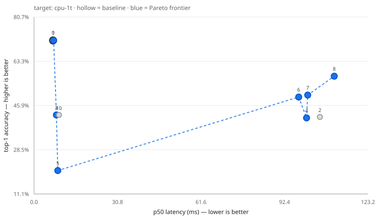

# Anneal run `de67915676f5`

## Setup

| | |
|---|---|
| Model | `torchvision:mobilenet_v3_large` |
| Target | `cpu-1t` (CPUExecutionProvider) |
| Threads | 1 intra-op, 1 inter-op |
| Machine | AMD64 Family 23 Model 96 Stepping 1, AuthenticAMD |
| Platform | Windows-11-10.0.26200-SP0 |
| onnxruntime | 1.30.0 |
| Policy | `heuristic` |
| Eval set | `imagenette` (256 images) |
| Latency protocol | 10 warm-up discarded, 50 timed runs, batch 1 |
| Budget | 10 trials |

**Accuracy resolution: ±5.5pp** (95% Wilson interval at n=256). Two trials whose top-1 differs by less than roughly this much are tied, not ranked. When the difference is within noise, `agreement` — the fraction of images where a candidate predicts the same class as the baseline — is the sharper signal, because it is paired per-image rather than an aggregate.

## Frontier

## All trials

| # | recipe | p50 ms | p99 ms | speedup | size MB | top-1 | Δpp | agreement |
|---:|---|---:|---:|---:|---:|---:|---:|---:|
| 0 | `baseline` | 7.03 | 8.41 | 1.00x | 20.91 | 71.48% | +0.00 | — |
| 1 | `graph_optimize(level=all)` | 7.25 | 10.00 | 0.97x | 20.91 | 71.48% | +0.00 | 1.000 |
| 2 | `quantize_dynamic_int8(per_channel=True,reduce_range=False,weight_type=int8)` | 105.46 | 135.38 | 0.07x | 5.46 | 41.41% | -30.08 | 0.453 |
| 3 | `quantize_static_int8(calib_samples=64,calibrate_method=minmax,per_channel=True,reduce_range=False)` | 8.25 | 9.45 | 0.85x | 5.73 | 42.19% | -29.30 | 0.480 |
| 4 | `quantize_dynamic_int8(per_channel=False,reduce_range=False,weight_type=int8)` | 100.52 | 109.81 | 0.07x | 5.45 | 41.02% | -30.47 | 0.449 |
| 5 | `quantize_static_int8(calib_samples=64,calibrate_method=minmax,per_channel=False,reduce_range=False)` | 8.77 | 10.37 | 0.80x | 5.48 | 20.31% | -51.17 | 0.223 |
| 6 | `quantize_dynamic_sensitive(per_channel=True,ranking=measured,skip_first_last=False,skip_top_k=1)` | 97.63 | 105.15 | 0.07x | 5.45 | 49.22% | -22.27 | 0.602 |
| 7 | `quantize_dynamic_sensitive(per_channel=True,ranking=measured,skip_first_last=False,skip_top_k=2)` | 100.96 | 148.26 | 0.07x | 5.52 | 50.00% | -21.48 | 0.625 |
| 8 | `quantize_dynamic_sensitive(per_channel=True,ranking=measured,skip_first_last=False,skip_top_k=4)` | 110.75 | 145.83 | 0.06x | 5.55 | 57.42% | -14.06 | 0.738 |
| 9 | `graph_optimize(level=all) -> graph_optimize(level=all)` | failed | | | | | | |
| 10 | `quantize_static_int8(calib_samples=64,calibrate_method=entropy,per_channel=True,reduce_range=False)` | 9.21 | 10.85 | 0.76x | 5.73 | 42.19% | -29.30 | 0.480 |

## Pareto frontier

Non-dominated across (latency p50, size, top-1). No single row is 'best' — pick by whichever constraint binds you.

| # | recipe | p50 ms | p99 ms | speedup | size MB | top-1 | Δpp | agreement |
|---:|---|---:|---:|---:|---:|---:|---:|---:|
| 0 | `baseline` | 7.03 | 8.41 | 1.00x | 20.91 | 71.48% | +0.00 | — |
| 1 | `graph_optimize(level=all)` | 7.25 | 10.00 | 0.97x | 20.91 | 71.48% | +0.00 | 1.000 |
| 3 | `quantize_static_int8(calib_samples=64,calibrate_method=minmax,per_channel=True,reduce_range=False)` | 8.25 | 9.45 | 0.85x | 5.73 | 42.19% | -29.30 | 0.480 |
| 5 | `quantize_static_int8(calib_samples=64,calibrate_method=minmax,per_channel=False,reduce_range=False)` | 8.77 | 10.37 | 0.80x | 5.48 | 20.31% | -51.17 | 0.223 |
| 6 | `quantize_dynamic_sensitive(per_channel=True,ranking=measured,skip_first_last=False,skip_top_k=1)` | 97.63 | 105.15 | 0.07x | 5.45 | 49.22% | -22.27 | 0.602 |
| 4 | `quantize_dynamic_int8(per_channel=False,reduce_range=False,weight_type=int8)` | 100.52 | 109.81 | 0.07x | 5.45 | 41.02% | -30.47 | 0.449 |
| 7 | `quantize_dynamic_sensitive(per_channel=True,ranking=measured,skip_first_last=False,skip_top_k=2)` | 100.96 | 148.26 | 0.07x | 5.52 | 50.00% | -21.48 | 0.625 |
| 8 | `quantize_dynamic_sensitive(per_channel=True,ranking=measured,skip_first_last=False,skip_top_k=4)` | 110.75 | 145.83 | 0.06x | 5.55 | 57.42% | -14.06 | 0.738 |

## Recommended pick

**`baseline`** — trial 0.

- 1.00x faster (p50)
- +0.00pp top-1
- 100% of baseline size

> Unmodified model. Every other number is relative to this one.

## Portability caveats

A fast number on this machine is not automatically a fast number on the deployment target. These artifacts carry hardware-specific assumptions:

- **Trial 1** (`graph_optimize(level=all)`): level='all' bakes in NCHWc layout transforms specific to the CPU that ran the optimisation; this artifact is only valid on matching hardware. Use level='extended' for a portable file.
- **Trial 9** (`graph_optimize(level=all) -> graph_optimize(level=all)`): level='all' bakes in NCHWc layout transforms specific to the CPU that ran the optimisation; this artifact is only valid on matching hardware. Use level='extended' for a portable file.

## Failed trials

Recorded rather than hidden — a transform that does not apply is a real property of this model and target.

- `graph_optimize(level=all) -> graph_optimize(level=all)` — TransformError: 'graph_optimize' is already in this model's lineage; applying it twice is a no-op

## Reproducing

Every row above is a recipe. To rebuild one, apply its transform chain to the baseline model with the same parameters; the ledger JSON alongside this report records the exact parameters, the machine fingerprint and the measurement protocol used.
