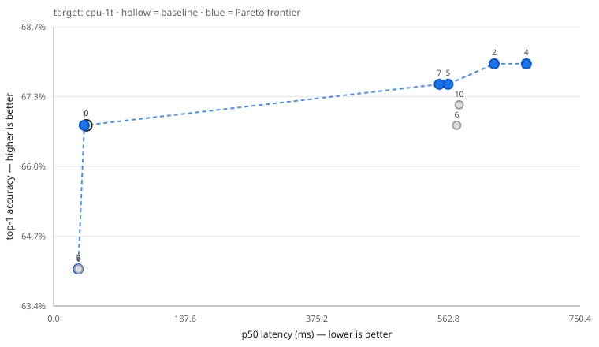

# Anneal run `7d39f0004692`

## Setup

| | |
|---|---|
| Model | `torchvision:resnet18` |
| Target | `cpu-1t` (CPUExecutionProvider) |
| Threads | 1 intra-op, 1 inter-op |
| Machine | AMD64 Family 23 Model 96 Stepping 1, AuthenticAMD |
| Platform | Windows-11-10.0.26200-SP0 |
| onnxruntime | 1.30.0 |
| Policy | `heuristic` |
| Eval set | `imagenette` (256 images) |
| Latency protocol | 10 warm-up discarded, 50 timed runs, batch 1 |
| Budget | 10 trials |

**Accuracy resolution: ±5.7pp** (95% Wilson interval at n=256). Two trials whose top-1 differs by less than roughly this much are tied, not ranked. When the difference is within noise, `agreement` — the fraction of images where a candidate predicts the same class as the baseline — is the sharper signal, because it is paired per-image rather than an aggregate.

## Frontier

## All trials

| # | recipe | p50 ms | p99 ms | speedup | size MB | top-1 | Δpp | agreement |
|---:|---|---:|---:|---:|---:|---:|---:|---:|
| 0 | `baseline` | 46.74 | 60.52 | 1.00x | 44.58 | 66.80% | +0.00 | — |
| 1 | `graph_optimize(level=all)` | 43.65 | 51.27 | 1.07x | 44.58 | 66.80% | +0.00 | 1.000 |
| 2 | `quantize_dynamic_int8(per_channel=True,reduce_range=False,weight_type=int8)` | 627.90 | 772.16 | 0.07x | 11.21 | 67.97% | +1.17 | 0.961 |
| 3 | `quantize_static_int8(calib_samples=64,calibrate_method=minmax,per_channel=True,reduce_range=False)` | 35.06 | 44.51 | 1.33x | 11.28 | 64.06% | -2.73 | 0.844 |
| 4 | `quantize_dynamic_int8(per_channel=False,reduce_range=False,weight_type=int8)` | 673.75 | 841.71 | 0.07x | 11.20 | 67.97% | +1.17 | 0.965 |
| 5 | `quantize_dynamic_sensitive(per_channel=True,skip_first_last=False,skip_top_k=1)` | 562.16 | 691.86 | 0.08x | 12.89 | 67.58% | +0.78 | 0.961 |
| 6 | `quantize_dynamic_sensitive(per_channel=True,skip_first_last=False,skip_top_k=2)` | 574.44 | 883.40 | 0.08x | 13.00 | 66.80% | +0.00 | 0.961 |
| 7 | `quantize_dynamic_sensitive(per_channel=True,skip_first_last=False,skip_top_k=4)` | 549.71 | 746.11 | 0.09x | 20.17 | 67.58% | +0.78 | 0.961 |
| 8 | `graph_optimize(level=all) -> quantize_static_int8(calib_samples=64,calibrate_method=minmax,per_channel=True,reduce_range=False)` | failed | | | | | | |
| 9 | `quantize_static_int8(calib_samples=64,calibrate_method=entropy,per_channel=True,reduce_range=False)` | 35.45 | 46.56 | 1.32x | 11.28 | 64.06% | -2.73 | 0.844 |
| 10 | `quantize_dynamic_sensitive(per_channel=True,skip_first_last=True,skip_top_k=1)` | 578.05 | 770.82 | 0.08x | 12.92 | 67.19% | +0.39 | 0.965 |

## Pareto frontier

Non-dominated across (latency p50, size, top-1). No single row is 'best' — pick by whichever constraint binds you.

| # | recipe | p50 ms | p99 ms | speedup | size MB | top-1 | Δpp | agreement |
|---:|---|---:|---:|---:|---:|---:|---:|---:|
| 3 | `quantize_static_int8(calib_samples=64,calibrate_method=minmax,per_channel=True,reduce_range=False)` | 35.06 | 44.51 | 1.33x | 11.28 | 64.06% | -2.73 | 0.844 |
| 1 | `graph_optimize(level=all)` | 43.65 | 51.27 | 1.07x | 44.58 | 66.80% | +0.00 | 1.000 |
| 7 | `quantize_dynamic_sensitive(per_channel=True,skip_first_last=False,skip_top_k=4)` | 549.71 | 746.11 | 0.09x | 20.17 | 67.58% | +0.78 | 0.961 |
| 5 | `quantize_dynamic_sensitive(per_channel=True,skip_first_last=False,skip_top_k=1)` | 562.16 | 691.86 | 0.08x | 12.89 | 67.58% | +0.78 | 0.961 |
| 2 | `quantize_dynamic_int8(per_channel=True,reduce_range=False,weight_type=int8)` | 627.90 | 772.16 | 0.07x | 11.21 | 67.97% | +1.17 | 0.961 |
| 4 | `quantize_dynamic_int8(per_channel=False,reduce_range=False,weight_type=int8)` | 673.75 | 841.71 | 0.07x | 11.20 | 67.97% | +1.17 | 0.965 |

## Recommended pick

**`graph_optimize(level=all)`** — trial 1.

- 1.07x faster (p50)
- +0.00pp top-1
- 100% of baseline size

> Lossless baseline: establish what fusion alone buys before touching precision.

## Failed trials

Recorded rather than hidden — a transform that does not apply is a real property of this model and target.

- `graph_optimize(level=all) -> quantize_static_int8(calib_samples=64,calibrate_method=minmax,per_channel=True,reduce_range=False)` — ValueError: Unable to get valid quantization scale for input 'reorder_token_1' when quantizing bias 'onnx::Conv_197' to int32.

## Reproducing

Every row above is a recipe. To rebuild one, apply its transform chain to the baseline model with the same parameters; the ledger JSON alongside this report records the exact parameters, the machine fingerprint and the measurement protocol used.
